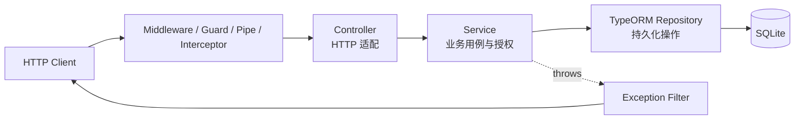
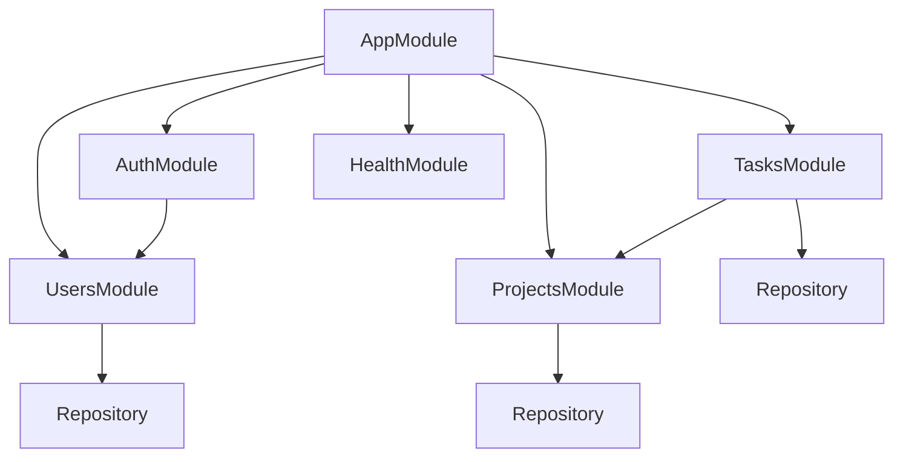
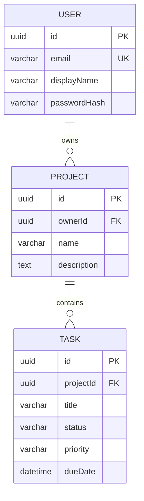

# TaskFlow 架构说明

这份文档是最终项目的“地图”。学习具体语法时遇到迷路，可以回到这里确认：请求处在哪一层、数据归哪个模块、谁有权调用谁。

## 1. 系统目标

TaskFlow 是一个单体 REST API，提供：

- 用户注册、登录和当前用户信息；
- 当前用户自己的项目 CRUD；
- 项目内任务 CRUD；
- 任务分页、状态/优先级筛选和排序；
- JWT 认证、资源所有权授权；
- SQLite 持久化、显式数据库迁移；
- 统一验证、错误格式、requestId、耗时日志；
- Swagger 文档与存活/就绪健康检查。

API 基地址为 `http://localhost:3000/api`；设置 `SWAGGER_ENABLED=true` 后，交互文档位于 `/api/docs`。

## 2. 分层与调用方向



依赖只向内指向更稳定的业务和数据边界：

- Controller 读取 path/query/body/current user，调用 Service，不直接操作数据库。
- Service 执行用例、资源归属检查和数据规范化，通过 Repository 持久化。
- Entity 描述数据库映射，不作为不受限制的外部输入；输入使用 DTO。
- `src/common` 放真正跨模块的请求能力，不放某个领域独有规则。

## 3. 模块图



- **UsersModule**：用户数据与安全的公开用户投影；向 AuthModule 导出 UsersService。
- **AuthModule**：注册、登录、JWT 签发；依赖 UsersModule。
- **ProjectsModule**：项目 CRUD 与 `findOneOwned` 所有权边界；向 TasksModule 导出 ProjectsService。
- **TasksModule**：项目内任务 CRUD 与列表查询；先通过 ProjectsService 验证项目归属。
- **HealthModule**：进程 liveness 与数据库 readiness。
- **AppModule**：配置、TypeORM、限流、全局 Guard/Filter/Interceptor 与模块组合。

模块 export 只开放协作需要的 Provider。TasksModule 不能绕过 ProjectsService 任意访问他人的项目。

## 4. 请求生命周期

一次典型受保护请求的主线：

1. RequestIdMiddleware 接收或生成 `x-request-id`，写入请求与响应头。
2. ThrottlerGuard 检查频率限制。
3. JwtAuthGuard 读取 Bearer token；公开路由由 `@Public()` 元数据放行。
4. LoggingInterceptor 记录开始时间并包裹后续调用。
5. ValidationPipe 转换并验证 path/query/body。
6. Controller 读取 `@CurrentUser()` 和 DTO，调用 Service。
7. Service 验证 owner 边界、执行规则并访问 Repository。
8. Interceptor 在调用结束时记录耗时和 requestId。
9. 若任何适用阶段抛错，HttpExceptionFilter 生成统一错误响应。

错误响应形状：

```json
{
  "statusCode": 404,
  "error": "Not Found",
  "message": "项目不存在",
  "path": "/api/projects/...",
  "timestamp": "2026-08-12T12:00:00.000Z",
  "requestId": "..."
}
```

成功响应不做统一外层包装；只有任务分页使用有意义的 `{ data, meta }` 结构。

## 5. 数据模型与所有权



关键不变量：

- 邮箱规范化后唯一；密码只以 hash 保存，默认查询不选择 passwordHash。
- 项目的 ownerId 只来自已验证 JWT 用户，不能来自客户端 body。
- 项目列表按 ownerId 过滤；项目详情/修改/删除使用 `findOneOwned(id, ownerId)`。
- 任务操作先验证当前用户拥有 projectId，再用 `{ taskId, projectId }` 查询任务。
- 删除用户级联删除项目，删除项目级联删除任务；因此删除必须先授权。

当前模型只有项目所有者，没有成员与角色表。若以后增加协作，应新增 ProjectMember 与明确权限矩阵，而不是把 owner 检查散落成更多条件。

## 6. 持久化与迁移

应用运行时由 `TypeOrmModule.forRootAsync()` 建立连接，各领域模块用 `forFeature()` 获取 Repository。TypeORM CLI 使用 `src/database/data-source.ts`。

数据库结构由 `src/database/migrations` 管理，`synchronize` 保持 `false`。Entity 改动不会自动安全地变更已有表；需要新增 Migration，审查 `up/down`，在目标环境类型上演练并备份。示例 `.env` 为本地学习显式启用启动迁移，代码默认值保持关闭；多实例生产环境应在发布流程中执行单次受控迁移。

SQLite 适合本地学习和测试。需要多实例并发、高可用或集中备份时，应迁移到服务型数据库，并重新设计连接、事务和发布步骤。

## 7. 安全边界

安全由多层共同完成：

- Helmet 设置常用安全响应头。
- CORS 只允许配置中的来源。
- ThrottlerGuard 限制请求频率。
- ValidationPipe 拒绝非法和额外字段。
- JwtAuthGuard 建立可信身份；`@Public()` 只用于少数公开接口。
- Service 进行资源级授权，防止横向越权。
- JWT secret 与数据库路径来自启动时校验的配置。
- HttpExceptionFilter 隐藏未知内部错误，使用 requestId 关联日志。

这些层不能互相替代：已登录不等于有权访问某资源，输入合法也不等于业务允许。

## 8. 目录导航

```text
src/
├── main.ts                 # HTTP 应用启动
├── app.setup.ts            # 生产与 E2E 共用的全局平台设置
├── app.module.ts           # 组合根、全局 Provider
├── app.controller.ts       # 公开课程入口
├── common/
│   ├── decorators/         # @Public、@CurrentUser
│   ├── filters/            # 统一异常响应
│   ├── guards/             # JWT 认证
│   ├── interceptors/       # 请求耗时日志
│   └── middleware/         # requestId
├── config/                 # 命名空间配置与 Joi 校验
├── database/               # DataSource 与 migrations
└── modules/
    ├── auth/               # 注册、登录、JWT
    ├── users/              # 用户持久化
    ├── projects/           # owner 项目 CRUD
    ├── tasks/              # 项目内任务 CRUD / 查询
    └── health/             # live / ready
```

## 9. 演进方向

完成主线后可按真实需求继续：

- ProjectMember 与 OWNER/MEMBER 权限矩阵；
- PostgreSQL、事务和并发控制；
- refresh token、撤销与会话管理；
- 游标分页、全文搜索；
- 结构化日志、指标、分布式追踪；
- 缓存、队列、定时任务；
- 在边界清楚后再评估 WebSocket、GraphQL、CQRS 或微服务。

演进时保持同一原则：先描述要保护的不变量，再选择 Nest 组件与基础设施。
